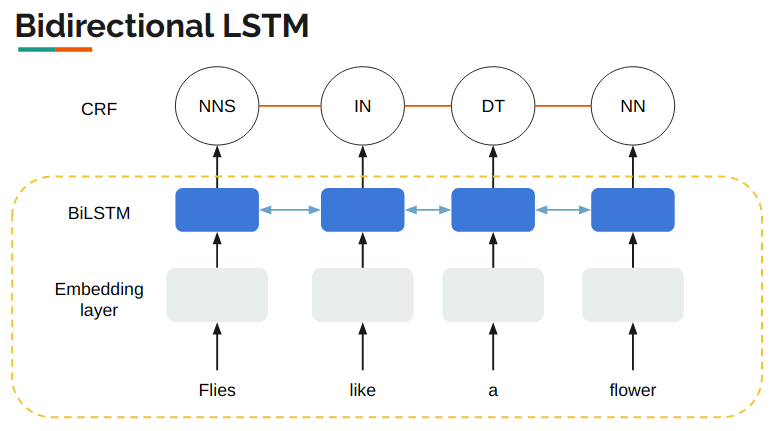
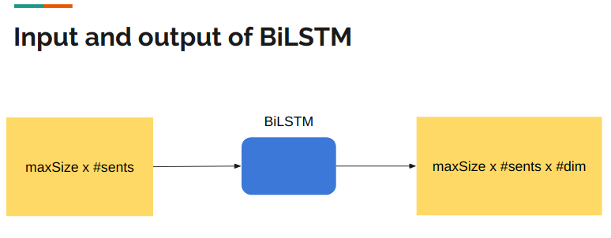
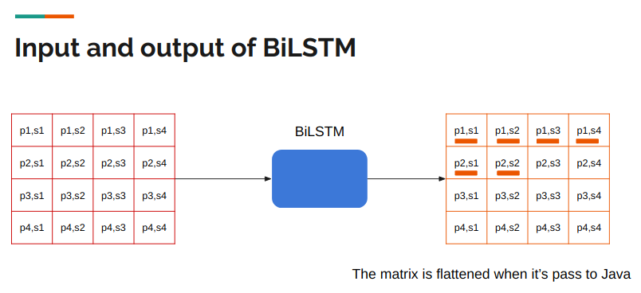

# LSTM-CRF Implementation Notes

In this example, we will use StatNLP framework to build a LSTM-CRF model for POS tagging task.

For simplification, we will use a Linear-Chain CRF. We will elaborate how to build the CRF first, then the LSTM.

## 1.Linear-Chain CRF
In order to build this model, we have four components to implement: 

- Build the Network Structure
- Extract the Feature
- Learning
- Decoding


Correspondingly, we create four classes by using StatNLP framework to implement them. They are:
- TagInstance
- TagNetworkCompiler
- TagFeatureManager
- TagMain

Next, we will implement them step-by-step.
### 1.1 Build the Network Structrue
In order to build the network structure, we need to implement our own class TagNetworkCompiler(), which extends from the class NetworkCompiler() and enables us to design the structure we want. Before implementing that, we need to implement a class called TagInstance, which encapsulates the sentence and the corresponding tags. 
#### 1.1.1 Create class TagInstance, which extends the class BaseInstance in the framework.

```java
public class TagInstance extends BaseInstance<SELF, IN, OUT>{
    
}
```

Then we specify three components of BaseInstance. For the SELF is simply the TagInstance. Because we are doing POS tagging, so the input is a sentence and the output is the tag for each word. Therefore, we specify the IN by using the class Sentence in the framework. We specify the out by using a list of String.

```java
public class TagInstance extends BaseInstance<TagInstance, Sentence, List<String>>{
    
}
```

Then we generate the serialVersionUID for saving the object. We will do this for other classes.
After that, we need to implement the method size(), which denotes the length of the input.Also, we need constructors. The second constructor contains the input and output. 

```java
public class TagInstance extends BaseInstance<TagInstance, Sentence, List<String>> {

	private static final long serialVersionUID = 7965976023854694105L;

	public TagInstance(int instanceId, double weight) {
		this(instanceId, weight, null, null);
	}
	
	public TagInstance(int instanceId, double weight, Sentence sent, List<String> output) {
		super(instanceId, weight);
		this.input = sent;
		this.output = output;
	}

	@Override
	public int size() {
		return this.input.length();
	}
}   
```


#### 1.1.2 Extends the class NetworkCompiler to build the network structure.
```java

public class tagNetworkCompiler extends NetworkCompiler {

    private static final long serialVersionUID = 1682064845617849422L;

    public tagNetworkCompiler() {
    }

    @Override
    public Network compileLabeled(int networkId, Instance inst, LocalNetworkParam param) {
        return null;
    }

    @Override
    public Network compileUnlabeled(int networkId, Instance inst, LocalNetworkParam param) {
        return null;
    }

    @Override
    public Instance decompile(Network network) {
        return null;
    }
}

```
As we can see, we need to implement three methods: **compileLabeled**, **compileUnlabeled** and **decompile**. 

**compileLabeled()**: This method actually represents the numerator of the formula of CRF (The gold **Y**). 

**compileUnlabeled()**: Whereas, this method represents the denominator of the formula of CRF (all the possible **Y**s). 

**decompile()**: The method denotes the decoding part. After running the Viterbi algorithm on the network, we can get predictions by using it.

Before we implement these three methods, we need to include a few member variables.
We use a list of strings to denote all possible tags. A hashmap to map the label to a unique label Id. 

```java
protected List<String> labels;
	protected Map<String, Integer> labelId;
```

Then we pass the labels to the constructor and initialize the labelId:
```java
public TagNetworkCompiler(List<String> labels) {
		this.labels = labels;
		this.labelId = new HashMap<>(labels.size());
		for (int i = 0; i < this.labels.size(); i++) {
			labelId.put(this.labels.get(i), i);
		}
	}
```
####  compileLabeled() 
Firstly, we implement the labeled network. In order to build the network (labeled or unlabeled), we need to predefine three kinds of nodes. 

```java
protected enum NodeType {
		leaf, tag, root
	};
	
```

Normally, we use a **leaf** node to denote the **START** state, a **root** node to denote the **END** state. The tag node simply represents normal nodes, which have corresponding tags in the network. 

In order to uniquely identify a node in the network, we need to include some information in a node. Take our Linear-Chain CRF as an example, a node should contain position and tag Id. Therefore, we create following functions:

```java
protected long toNode_root (int size) {
		return toNode(size - 1, this.labels.size(), NodeType.root);
	}
	
	protected long toNode_tag (int pos, int labelId) {
		return toNode(pos, labelId, NodeType.tag);
	}
	
	protected long toNode_Leaf () {
		return toNode(0, 0, NodeType.leaf);
	}
	
	protected long toNode(int pos, int labelId, NodeType nodeType) {
		return NetworkIDMapper.toHybridNodeID(new int[]{pos, labelId, nodeType.ordinal()});
	}
	
```

As shown above, we call the **toHybridNodeID** of NetworkIDMapper to convert an array into a long id, which enables us to use a unique **ID** to represent the information. Moreover, we can convert the long id back to the array by using **toHybridNodeArray** method.
For the leaf node and root, we actually do not store any information in them. However, we need to make sure that the ID of the root node is the largest, while the ID of the leaf node is the smallest in the network.

Here we represent a node by using information from three dimensions. Actually, we need to define it beforehand. 

```java
	static {
		NetworkIDMapper.setCapacity(new int[] {200, 100, 3});
	}
```

The first dimension is the position. Here, we set the maximum size of the position is 200. The second one is the tagId. We assume that we have less than 100 types of tags. The last one is the nodetype. We only have three kinds of nodes-leaf, tag and root. You can also put it in the constructor.

Let's get back to the compileLabeled() method:
```java
public BaseNetwork compileLabeled(int networkId, Instance inst, LocalNetworkParam param) {
		NetworkBuilder<BaseNetwork> builder = NetworkBuilder.builder();
		TagInstance tagInst = (TagInstance)inst;
		List<String> output =  tagInst.getOutput();
	}
```
Firstly, we create a builder of the class NetworkBuilder. Then we cast the inst into TagInstance and get its output, which are tags of the input sentence.

Then we can add nodes and edges into the builder, which means building the network.
```java
public BaseNetwork compileLabeled(int networkId, Instance inst, LocalNetworkParam param) {
		NetworkBuilder<BaseNetwork> builder = NetworkBuilder.builder();
		TagInstance tagInst = (TagInstance)inst;
		List<String> output =  tagInst.getOutput();
        long leaf = toNode_Leaf();
		builder.addNode(leaf);
		long[] children = new long[]{leaf};
        
		for (int i = 0; i < inst.size(); i++) {
			String label = output.get(i);
			long tagNode = this.toNode_tag(i, this.labelId.get(label));
			builder.addNode(tagNode);
			builder.addEdge(tagNode, children);
			children = new long[]{tagNode};
		}
        
		long root = this.toNode_root(inst.size());
		builder.addNode(root);
		builder.addEdge(root, children);
		BaseNetwork labeledNetwork = builder.build(networkId, inst, param, this);
		return labeledNetwork;
	}
```

To begin with, we add the leaf node (**START** state)into the builder. Because we need to add edges between current nodes and previous nodes, we should create a long array to store previous nodes (children). Next, we add every node with its corresponding gold tag into the builder in the for loop. After finishing that, we add the root node, which denotes the **END** state. Remember that we still need to add Edges between the root node and previous nodes.

Finally, we can attain the network by calling the build method of the builder.

#### compileUnlabeled() 
Let's move to the compileUnlabeled network. Before we implement this method. We need to build a **genericNetwork** first. I will explain it why we should do this later.

Therefore, we include two more member variables in the NetworkCompiler() class.
```java
protected List<String> labels;
protected Map<String, Integer> labelId;
protected int maxSize = 150; 
protected BaseNetwork genericNetwork;
```

The first one denotes the maximum size of the input sentence during training and test. Next, the genericNetwork belongs to the BaseNetwork class. 

In order to build the genericNetowrk, we need to create a corresponding method and call it in the constructor.

```java
private void buildGenericNetwork() {
}

public TagNetworkCompiler(List<String> labels) {
		this.labels = labels;
		this.labelId = new HashMap<>(labels.size());
		for (int i = 0; i < this.labels.size(); i++) {
			labelId.put(this.labels.get(i), i);
		}
		this.buildGenericNetwork();
	}
```

Implementing the buildGenericNetwork is quite similar to what we do in the compileLabeled network.

```java
private void buildGenericNetwork() {
		NetworkBuilder<BaseNetwork> builder = NetworkBuilder.builder();
		long leaf = toNode_Leaf();
		builder.addNode(leaf);
		long[] children = new long[]{leaf};
		for (int i = 0; i < this.maxSize; i++) {
			long[] current = new long[this.labels.size()];
			for (int l = 0; l < this.labels.size(); l++) {
				long tagNode =  this.toNode_tag(i, l);
				builder.addNode(tagNode);
				for (long child : children) {
					builder.addEdge(tagNode, new long[]{child});
				}
				current[l] = tagNode;
			}
			children = current;
			long root = this.toNode_root(i + 1);
			builder.addNode(root);
			for (long child : children) {
				builder.addEdge(root, new long[]{child});
			}
		}
		this.genericNetwork =  builder.buildRudimentaryNetwork();
	}
```
Comparing it with the compileLabeled() method, the biggest difference is that we add two more for loops in the method. The first one-```for (int i = 0; i < this.maxSize; i++) ``` iterates through every possible length of the input sentence. The second one-```for (long child : children) ``` iterates through every child node in the children array in order to add edges between previous nodes and current nodes. 

Why this difference exists? The reason behind it is that we only have **one path (gold Y)**. We know the size of every sentence and the gold tag for each position. On the other hand, in this generic network, we do not have the gold tag. Thus, we need to enumerate all possible tags (nodes) and edges between them. In order words, we are building a fully-connected network rather than one path. 

Moreover, we need to add a root node for every i (length of the sentence). Because when we are building the unlabeled network, we need a root node to get the number of nodes for any possible length of sentence. Also, in the decoding phase, we need to do backtrack from the root node (**END** state). 

To sum up, we have three for loops in the buildGenericNetwork() method. The first loop enumerates all possible lengths of sentences. The second one enumerates all possible types of tags. The last one enumerates all possible previous nodes(equals to all possible types of tags). Hence, the complexity is $ O(nT^2) $. $ n $ represents the length of the sentence while $ T $ represents the number of all possible tags.

Once we have this fully-connected network, it is easy for us to implement the compileUnlabeled() method:

```java
public BaseNetwork compileUnlabeled(int networkId, Instance inst, LocalNetworkParam param) {
		long[] nodes = this.genericNetwork.getAllNodes();
		int[][][] children = this.genericNetwork.getAllChildren();
	}
```
We can use **getAllNodes()** to get **ID**s of all the nodes in the generic network.

The **getAllChildren()** methods can give us a list of children nodes for every node in the network.

```java
public BaseNetwork compileUnlabeled(int networkId, Instance inst, LocalNetworkParam param) {
		long[] nodes = this.genericNetwork.getAllNodes();
		int[][][] children = this.genericNetwork.getAllChildren();
		int size = inst.size();
		long rootNode = this.toNode_root(size);
		int rootIdx = Arrays.binarySearch(nodes, rootNode);
		BaseNetwork unlabeledNetwork = NetworkBuilder.quickBuild(networkId, inst, nodes, children, rootIdx + 1, param, this);
		return unlabeledNetwork;
	}
```
In order to call the **quickBuild()** method in NetworkBuilder, we need a paramter called **numNodes**, which means the number of nodes in the unlabeled network. Therefore, we create a root node for a specific size of the input. Then use it to find to root index by **binarySerach()** method. The number of nodes should be equal to **rootIdx+1** here(including itself).

#### decompile()
Eventually, we have reached the decompile part. In the StatNLP framework, the Viterbi algorithm has already been done before we call this method. Hence, what we do in this method is just the backtracking.

```java
public Instance decompile(Network network) {
		BaseNetwork unlabeledNetwork = (BaseNetwork)network;
		Instance inst = network.getInstance();
		int size = inst.size();
		long rootNode = this.toNode_root(size);
		int currIdx = Arrays.binarySearch(unlabeledNetwork.getAllNodes(), rootNode);
		List<String> prediction = new ArrayList<>(size);
	}
```

Before the backtracking, we have a few steps to do. In the first place, we need to cast the network into BaseNetwork as the labeled network and the unlabeled network both are BaseNetworks. Next, we get the size of the instance. We use it to get the root node. We can get the index of the current node(root node) in the unlabeled network. Also, we need a list of String in order to store the prediction.

```java
public Instance decompile(Network network) {
		BaseNetwork unlabeledNetwork = (BaseNetwork)network;
		Instance inst = network.getInstance();
		int size = inst.size();
		long rootNode = this.toNode_root(size);
		int currIdx = Arrays.binarySearch(unlabeledNetwork.getAllNodes(), rootNode);
		List<String> prediction = new ArrayList<>(size);
        
 		for (int i = 0; i < size; i++) {
			int[] children = unlabeledNetwork.getMaxPath(currIdx);
			int child = children[0];
			int[] childArr = unlabeledNetwork.getNodeArray(child);
			prediction.add(0, this.labels.get(childArr[1]));
			currIdx = child;
		}
 		inst.setPrediction(prediction);
		return inst;
	}
```
Then, We get the predicted tag iteratively.The method **getMaxPath()** will return the optimal child node of the current node. Moreover, in Linear-Chain CRF, the length of children nodes is always 1(do not have hyperedge). Therefore, we use ```int child = children[0]```. Next, we call the **getNodeArray** method to get the int array of the child node. The array contains three-dimensional information-position, tagId and nodetype. Thus, **this.labels.get(childArr[1])** can give us the predicted tag of the child node. The last step is simply to call the method **setPrediction** of the instance and return the instance.

Here is the complete code of **TagNetworkCompiler**:
```java
public class TagNetworkCompiler extends NetworkCompiler {

	private static final long serialVersionUID = -3604477993417532194L;

	protected List<String> labels;
	protected Map<String, Integer> labelId;
	protected int maxSize = 150; 
	protected BaseNetwork genericNetwork;
	
	protected final boolean DEBUG = true;

	protected enum NodeType {
		leaf, tag, root
	};
	
	static {
		NetworkIDMapper.setCapacity(new int[] {200, 100, 3});
	}
	
	public TagNetworkCompiler(List<String> labels) {
		this.labels = labels;
		this.labelId = new HashMap<>(labels.size());
		for (int i = 0; i < this.labels.size(); i++) {
			labelId.put(this.labels.get(i), i);
		}
		this.buildGenericNetwork();
	}

	public TagNetworkCompiler(Pipeline<?> pipeline) {
		super(pipeline);
	}
	
	protected long toNode_root (int size) {
		return toNode(size - 1, this.labels.size(), NodeType.root);
	}
	
	protected long toNode_tag (int pos, int labelId) {
		return toNode(pos, labelId, NodeType.tag);
	}
	
	protected long toNode_Leaf () {
		return toNode(0, 0, NodeType.leaf);
	}
	
	protected long toNode(int pos, int labelId, NodeType nodeType) {
		return NetworkIDMapper.toHybridNodeID(new int[]{pos, labelId, nodeType.ordinal()});
	}
	
	@Override
	public BaseNetwork compileLabeled(int networkId, Instance inst, LocalNetworkParam param) {
		NetworkBuilder<BaseNetwork> builder = NetworkBuilder.builder();
		TagInstance tagInst = (TagInstance)inst;
		long leaf = toNode_Leaf();
		builder.addNode(leaf);
		List<String> output =  tagInst.getOutput();
		long[] children = new long[]{leaf};
		for (int i = 0; i < inst.size(); i++) {
			String label = output.get(i);
			long tagNode = this.toNode_tag(i, this.labelId.get(label));
			builder.addNode(tagNode);
			builder.addEdge(tagNode, children);
			children = new long[]{tagNode};
		}
		long root = this.toNode_root(inst.size());
		builder.addNode(root);
		builder.addEdge(root, children);
		BaseNetwork labeledNetwork = builder.build(networkId, inst, param, this);
		if (DEBUG) {
			BaseNetwork unlabeledNetwork = this.compileUnlabeled(networkId, inst, param);
			if (!unlabeledNetwork.contains(labeledNetwork)) {
				throw new RuntimeException("the labeled network is not contained");
			}
		}
		return labeledNetwork;
	}

	@Override
	public BaseNetwork compileUnlabeled(int networkId, Instance inst, LocalNetworkParam param) {
		long[] nodes = this.genericNetwork.getAllNodes();
		int[][][] children = this.genericNetwork.getAllChildren();
		int size = inst.size();
		long rootNode = this.toNode_root(size);
		int rootIdx = Arrays.binarySearch(nodes, rootNode);
		BaseNetwork unlabeledNetwork = NetworkBuilder.quickBuild(networkId, inst, nodes, children, rootIdx + 1, param, this);
		return unlabeledNetwork;
	}
	
	private void buildGenericNetwork() {
		NetworkBuilder<BaseNetwork> builder = NetworkBuilder.builder();
		long leaf = toNode_Leaf();
		builder.addNode(leaf);
		long[] children = new long[]{leaf};
		for (int i = 0; i < this.maxSize; i++) {
			long[] current = new long[this.labels.size()];
			for (int l = 0; l < this.labels.size(); l++) {
				long tagNode =  this.toNode_tag(i, l);
				builder.addNode(tagNode);
				for (long child : children) {
					builder.addEdge(tagNode, new long[]{child});
				}
				current[l] = tagNode;
			}
			children = current;
			long root = this.toNode_root(i + 1);
			builder.addNode(root);
			for (long child : children) {
				builder.addEdge(root, new long[]{child});
			}
		}
		this.genericNetwork =  builder.buildRudimentaryNetwork();
	}

	@Override
	public Instance decompile(Network network) {
		BaseNetwork unlabeledNetwork = (BaseNetwork)network;
		Instance inst = network.getInstance();
		int size = inst.size();
		long rootNode = this.toNode_root(size);
		int currIdx = Arrays.binarySearch(unlabeledNetwork.getAllNodes(), rootNode);
		List<String> prediction = new ArrayList<>(size);
 		for (int i = 0; i < size; i++) {
			int[] children = unlabeledNetwork.getMaxPath(currIdx);
			int child = children[0];
			int[] childArr = unlabeledNetwork.getNodeArray(child);
			prediction.add(0, this.labels.get(childArr[1]));
			currIdx = child;
		}
 		inst.setPrediction(prediction);
		return inst;
	}

}
```


### 1.2 Extract the feature
After building the network structure, we can extract features over edges in the network. Here, we need to implement our own **TagFeatureManager()** class, which extends from the class **FeatureManager()**.

```java
public class tagFeatureManager extends FeatureManager {

    private static final long serialVersionUID = -2252842155250276901L;

    public tagFeatureManager(GlobalNetworkParam param_g, InstanceParser instanceParser) {
        super(param_g, instanceParser);
    }

    public tagFeatureManager(GlobalNetworkParam param_g) {
        super(param_g);
    }

    @Override
    protected FeatureArray extract_helper(Network network, int parent_k, int[] children_k, int children_k_index) {
        return null;
    }
}
```

As we can see we have two constructors. Also, an extract_helper() method need to be rewritten. Because features are over edges, so we have parent nodes and children nodes in the arguments of the **extract_helper()**.

```java
public class TagFeatureManager extends FeatureManager {

	private enum FeaType {
		unigram, bigram, transition
	}

```
Before we implement the **extract_helper()** method, we need to create an enum object called FeaType, which contains three kinds of features we will use. Actually, we will incorporate neural features later in the LSTM section. But now, we will skip it.

```java
protected FeatureArray extract_helper(Network network, int parent_k, int[] children_k, int children_k_index) {
		
		int[] paArr = network.getNodeArray(parent_k);
		if (NodeType.values()[paArr[2]] == NodeType.leaf || NodeType.values()[paArr[2]] == NodeType.root)
			return FeatureArray.EMPTY;
		List<Integer> fs = new ArrayList<>();
		TagInstance inst = (TagInstance) network.getInstance();
		Sentence sent = inst.getInput();
		
		int pos = paArr[0];
		int labelId = paArr[1];
		String output = labelId + "";
		String word = sent.get(pos).getForm();
		String lw = pos - 1 >= 0 ? sent.get(pos - 1).getForm() : "START";
		String rw = pos + 1 < sent.length() ? sent.get(pos + 1).getForm() : "END";
	}
```

Firstly, we need to get the node array of the parent node **paArr**. Actually, we do not have any information stored in the leaf or root node. Therefore, if the nodetype is leaf or root, we will return an empty feature array.

Next, we create a list to store the feature. Cast the instance into TagInstance and get the input sentence. 

Then we can get the position and labelId from the paArr array. Also, we can get the current word, the corresponding tag, the left word of the current word and the right word of the current word.

```java
protected FeatureArray extract_helper(Network network, int parent_k, int[] children_k, int children_k_index) {

		fs.add(this._param_g.toFeature(network, FeaType.unigram.name(), output, word));
		fs.add(this._param_g.toFeature(network, FeaType.unigram.name() + "-left", output, lw));
		fs.add(this._param_g.toFeature(network, FeaType.unigram.name() + "-right", output, rw));
		
		fs.add(this._param_g.toFeature(network, FeaType.bigram.name() + "-1", output, lw + " " + word));
		fs.add(this._param_g.toFeature(network, FeaType.bigram.name() + "-2", output, word + " " + rw));
		
		int[] childArr = network.getNodeArray(children_k[0]);
		NodeType childNodeType = NodeType.values()[childArr[2]];
		int childLabelId = childArr[1];
		String childLabel = childNodeType == NodeType.leaf ? "START" : childLabelId + "";
		fs.add(this._param_g.toFeature(network, FeaType.transition.name(), output, childLabel));
		return this.createFeatureArray(network, fs);
	}
```

The crucial part is that we call the toFeature function, which takes network, feature type output and input as arguments, in order to add features into the list.

Here we have six kinds of features, unigram, unigram-left, unigram-right, bigram-1(take the left word), bigram-2(take the right word) and the transition feature. In order to get the transition feature, we need to know the label of the child node. 

Here is the complete code of **TagFeatureManager**:

```java
public class TagFeatureManager extends FeatureManager {

	private static final long serialVersionUID = -6059629463406022487L;

	private enum FeaType {
		unigram, bigram, transition
	}
	
	public TagFeatureManager(GlobalNetworkParam param_g) {
		super(param_g);
	}

	public TagFeatureManager(GlobalNetworkParam param_g, InstanceParser instanceParser) {
		super(param_g, instanceParser);
	}

	@Override
	protected FeatureArray extract_helper(Network network, int parent_k, int[] children_k, int children_k_index) {
		
		int[] paArr = network.getNodeArray(parent_k);
		if (NodeType.values()[paArr[2]] == NodeType.leaf || NodeType.values()[paArr[2]] == NodeType.root)
			return FeatureArray.EMPTY;
		List<Integer> fs = new ArrayList<>();
		TagInstance inst = (TagInstance) network.getInstance();
		Sentence sent = inst.getInput();
		
		int pos = paArr[0];
		int labelId = paArr[1];
		String output = labelId + "";
		String word = sent.get(pos).getForm();
		String lw = pos - 1 >= 0 ? sent.get(pos - 1).getForm() : "START";
		String rw = pos + 1 < sent.length() ? sent.get(pos + 1).getForm() : "END";

		fs.add(this._param_g.toFeature(network, FeaType.unigram.name(), output, word));
		fs.add(this._param_g.toFeature(network, FeaType.unigram.name() + "-left", output, lw));
		fs.add(this._param_g.toFeature(network, FeaType.unigram.name() + "-right", output, rw));
		
		fs.add(this._param_g.toFeature(network, FeaType.bigram.name() + "-1", output, lw + " " + word));
		fs.add(this._param_g.toFeature(network, FeaType.bigram.name() + "-0", output, word + " " + rw));
		
		int[] childArr = network.getNodeArray(children_k[0]);
		NodeType childNodeType = NodeType.values()[childArr[2]];
		int childLabelId = childArr[1];
		String childLabel = childNodeType == NodeType.leaf ? "START" : childLabelId + "";
		fs.add(this._param_g.toFeature(network, FeaType.transition.name(), output, childLabel));
		return this.createFeatureArray(network, fs);
	}

}
```


### 1.3 Learning & Decoding
Eventually, we need to implement the main function to do this. In the **TagMain()** class, we have three parts: read data, train model, decode and evaluation.

Here, we use the conll2000 dataset. It looks like this:
```
Confidence NN B-NP
in IN B-PP
the DT B-NP
pound NN I-NP
is VBZ B-VP
widely RB I-VP
expected VBN I-VP
to TO I-VP
take VB I-VP
another DT B-NP
sharp JJ I-NP
dive NN I-NP
```

The first column represents the word and the second column represents the tag. We write a function called **readDate()** to tackle with it.

```java
public static TagInstance[] readData(String path, boolean isTraining, int number) throws IOException{
		BufferedReader br = RAWF.reader(path);
		String line = null;
		List<TagInstance> insts = new ArrayList<TagInstance>();
		int index =1;
		ArrayList<WordToken> words = new ArrayList<WordToken>();
		ArrayList<String> tags = new ArrayList<String>();
		while((line = br.readLine())!=null){
			if(line.equals("")){
				WordToken[] wordsArr = new WordToken[words.size()];
				words.toArray(wordsArr);
				Sentence sent = new Sentence(wordsArr);
				TagInstance inst = new TagInstance(index++, 1.0, sent, tags);
				if(isTraining) {
					inst.setLabeled(); 
				} else {
					inst.setUnlabeled();
				}
				insts.add(inst);
				words = new ArrayList<WordToken>();
				tags = new ArrayList<String>();
				if(number!=-1 && insts.size()==number) break;
				continue;
			}
			String[] values = line.split(" ");
			String tag = values[1];
			if (isTraining && !labels.contains(tag))
				labels.add(tag);
			words.add(new WordToken(values[0]));
			tags.add(tag);
		}
		br.close();
		List<TagInstance> myInsts = insts;
		System.out.println("#instance:"+ myInsts.size()+" Instance. ");
		return myInsts.toArray(new TagInstance[myInsts.size()]);
	}  
```

Next, we train the model and do the decoding.

```java
public class TagMain {

	public static String trainFile = "data/train.txt";
	public static String testFile = "data/test.txt";
	public static int trainNum = 30;
	public static int testNum = 20;
	public static int numThreads = 10;
	public static double l2 = 0.01;
	public static int numIterations = 30;
	public static List<String> labels;
	
	public static void main(String[] args) throws IOException, InterruptedException{
		
		NetworkConfig.L2_REGULARIZATION_CONSTANT = l2;
		NetworkConfig.NUM_THREADS = numThreads;
		NetworkConfig.USE_NEURAL_FEATURES = true;
		
		labels = new ArrayList<>();
		TagInstance[] trainInstances = readData(trainFile, true, trainNum);
		System.out.println("#labels: " + labels.size());
		NetworkConfig.MODEL_TYPE = ModelType.CRF;
        
        GlobalNetworkParam gnp = new GlobalNetworkParam(OptimizerFactory.getLBFGSFactory(), gnnp);
		TagFeatureManager fa = new TagFeatureManager(gnp);
		TagNetworkCompiler compiler = new TagNetworkCompiler(labels);
		NetworkModel model = DiscriminativeNetworkModel.create(fa, compiler);
		model.train(trainInstances, numIterations);
		
 }
```

Here, we can see that we have defined many member variables for training, including: number of training instances, number of testing instances, number of threads, value of $l2$ norm and number of iterations.

In the main function, we call the readData function to get training instances. Then we new a GlobalNetworkParam called gnp by using getLBFGSFactory method in OptimizerFactory(use **L-BFGS** as optimizer). Once we have this parameter, we can new our TagFeatureManager. Next, we create a compiler by using TagNetowrkCompiler written by us before. Finally, we can call the create method of DiscriminativeNetworkModel(CRF belongs to discriminative model) to build our model. We can call the **train()** method to do the training.

```java
		TagInstance[] testInstances = readData(testFile, false, testNum);
		Instance[] predictions = model.decode(testInstances);
```

After that, we add two lines of code to do the decoding. It simply feeds the testInstances to the **decode** method of the model. Eventually, we get our predictions!

```java
		int corr = 0;
		int total = 0;
		for (Instance pred : predictions) {
			TagInstance inst = (TagInstance)pred;
			List<String> gold = inst.getOutput();
			List<String> prediction = inst.getPrediction();
			for (int i = 0; i < gold.size(); i++) {
				if (gold.get(i).equals(prediction.get(i)))
					corr++;
			}
			total += gold.size();
		}
		System.out.printf("[Accuracy]: %.2f%%\n", corr * 1.0 / total * 100);
```

The last part of the TagMain class is just how to do the evaluation. By now, we have finished our Linear-chain CRF model by using StatNLP framework!

Here is the complete code of **TagMain**:

```java
public class TagMain {

	public static String trainFile = "data/train.txt";
	public static String testFile = "data/test.txt";
	public static int trainNum = 30;
	public static int testNum = 20;
	public static int numThreads = 10;
	public static double l2 = 0.01;
	public static int numIterations = 30;
	public static List<String> labels;
	public static boolean visualization = false;
	
	public static void main(String[] args) throws IOException, InterruptedException{
		
		NetworkConfig.L2_REGULARIZATION_CONSTANT = l2;
		NetworkConfig.NUM_THREADS = numThreads;
		NetworkConfig.USE_NEURAL_FEATURES = true;
		
		labels = new ArrayList<>();
		TagInstance[] trainInstances = readData(trainFile, true, trainNum);
		System.out.println("#labels: " + labels.size());
		NetworkConfig.MODEL_TYPE = ModelType.CRF;
		
		GlobalNetworkParam gnp = new GlobalNetworkParam(OptimizerFactory.getLBFGSFactory(), gnnp);
		TagFeatureManager fa = new TagFeatureManager(gnp);
		TagNetworkCompiler compiler = new TagNetworkCompiler(labels);
		NetworkModel model = DiscriminativeNetworkModel.create(fa, compiler);
		model.train(trainInstances, numIterations);
		
		TagInstance[] testInstances = readData(testFile, false, testNum);
		Instance[] predictions = model.decode(testInstances);
		
		//evaluation
		int corr = 0;
		int total = 0;
		for (Instance pred : predictions) {
			TagInstance inst = (TagInstance)pred;
			List<String> gold = inst.getOutput();
			List<String> prediction = inst.getPrediction();
			for (int i = 0; i < gold.size(); i++) {
				if (gold.get(i).equals(prediction.get(i)))
					corr++;
			}
			total += gold.size();
		}
		System.out.printf("[Accuracy]: %.2f%%\n", corr * 1.0 / total * 100);
	}
	

	public static TagInstance[] readData(String path, boolean isTraining, int number) throws IOException{
		BufferedReader br = RAWF.reader(path);
		String line = null;
		List<TagInstance> insts = new ArrayList<TagInstance>();
		int index =1;
		ArrayList<WordToken> words = new ArrayList<WordToken>();
		ArrayList<String> tags = new ArrayList<String>();
		while((line = br.readLine())!=null){
			if(line.equals("")){
				WordToken[] wordsArr = new WordToken[words.size()];
				words.toArray(wordsArr);
				Sentence sent = new Sentence(wordsArr);
				TagInstance inst = new TagInstance(index++, 1.0, sent, tags);
				if(isTraining) {
					inst.setLabeled(); 
				} else {
					inst.setUnlabeled();
				}
				insts.add(inst);
				words = new ArrayList<WordToken>();
				tags = new ArrayList<String>();
				if(number!=-1 && insts.size()==number) break;
				continue;
			}
			String[] values = line.split(" ");
			String tag = values[1];
			if (isTraining && !labels.contains(tag))
				labels.add(tag);
			words.add(new WordToken(values[0]));
			tags.add(tag);
		}
		br.close();
		List<TagInstance> myInsts = insts;
		System.out.println("#instance:"+ myInsts.size()+" Instance. ");
		return myInsts.toArray(new TagInstance[myInsts.size()]);
	}

}
```

## 2.LSTM
The StatNLP framework currently supports Torch, so in this section, we will illustrate how to build the complete LSTM-CRF by using StatNLP and Torch.

Let's get started!



Basically, the structure of the LSTM-CRF looks like this. We have three layers: Embedding layer, BiLSTM layer and the CRF layer. The model takes word tokens as input. After the Embedding layer, we get vectors. Then vectors go through the BiLSTM layer will become hidden states. We will feed hidden states to the CRF layer and get predictions(tags). Traditionally, if we do not have the CRF layer, we will use Softmax layer.

As we can see the structure above, we will use Torch to implement the BiLSTM and Embedding layers and StatNLP to implement the Linear-Chain CRF.



Next, we will talk about input and output of the LSTM. They are both tensors. The shape of the input tensor is the maximum size of sentences multiplies the number of sentences. Because in Torch, the row has to be the size of the sentence. On the other hand, the shape of the output tensor is the maximum size of sentences multiply the number of sentences multiply the number of dimensions. Since the BiLSTM will output hidden states for each token, so the last term here the number of dimensions of the hidden state.

Actually, the output tensor will be flattened when it is passed to the JAVA(StatNLP framework). 



As shown above, let's investigate the input and output tensor with a simple example. Assuming that we have four sentences and the maximum lenght of these sentences is 4. Thus, we have a $4 \times 4$ matrix. Each cell stores a word ID. For example, "p1, s1" indicates that this wordID belongs to position one of the first input sentence, and so on. Whereas, in the ouput tensor, each cell stores a vector. The dimension of the vector equals to the dimension of the hidden state. Let me emphasize again that this output tensor will be **flattened(1-dimensional array)** when it is passed to JAVA.

You may want to ask how we can attain the specific vector from this flattened tensor? The answer is by using index. How to calculate the index? The formula should be-position $\times$ MaxSentSize $+$ sentenceID. For example, if we want to attain the vector for "p3, s3". Then the index should be: $(3-1) \times 4 + 3 = 12$. In practice, the index of position starts from 0, so there is no need to minus one when we write the code. 
### Training Procedure
- Forward pass in the neural network layers.
- Forward-Backward in the CRF layer.
- Backward pass(i.e., back propagation) in the neural network layers.
- Update parameters(e.g, SGD, L-BFGS)
- Iterate step 1 to 4 until converge.

After the theoretical explanation, we will go through how to connect the LSTM and the CRF model in the StatNLP framework. Basically, we will modify the **TagMain** method,  **TagFeatureManager** method and create a class called **TagBiLSTM**.

### 2.1 Modify TagMain() class

Firstly, open the TagMain class that we wrote previously and add few codes:

```java
		List<NeuralNetworkCore> nets = new ArrayList<NeuralNetworkCore>();
		
        GlobalNeuralNetworkParam gnnp = new GlobalNeuralNetworkParam(nets);
        
        if (NetworkConfig.USE_NEURAL_FEATURES) {
			NetworkConfig.L2_REGULARIZATION_CONSTANT = 0.01;
			TagBiLSTM net = new TagBiLSTM(labels.size());
			nets.add(net);
		}
        
		
```
The first line means that we create a list to store neural networks. Actually, the framework supports different types of neural networks simutaneously, such as MLP, CNN, LSTM etc.

The second line means that create a neural network parameter by feeding the list of nets to the GlobalNeuralNetworkParam class, similar to what we did in creating the CRF parameter previously. Next, we set the flag in NetworkConfig class that we will use the neural features. We set the $l2$ norm to be 0.01 and add the TagBiLSTM object to the list(nets).

### 2.2 Modify TagFeatureManager() class

Before we create the TagBiLSTM class, we need to add a few lines of codes in class TagFeatureMangaer, since we add features from BiLSTM.

```java
if (NetworkConfig.USE_NEURAL_FEATURES) {

			SimpleImmutableEntry<String, Integer> edgeInput = 
					new SimpleImmutableEntry<String, Integer>(sent.toString(), pos);
                    
			this.addNeural(network, 0, parent_k, children_k_index, edgeInput, labelId);
		}
```

For different types of neural networks, inputs are different from each other. Let's take MLP and BiLSTM as examples. In **MLP**, inputs are simply word tokens. Whereas, the input is an object containing sentence and positions in **BiLSTM**. Why is that? Because the BiLSTM takes the whole sentence as input, as what we showed in the picture-*Flies like a flower.* However, the BiLSTM need to output scores for each position(token) to the CRF layer. Hence, we need to create an **object** as input, which contains both the **sentence and corresponding positions**.

As what we have discussed above, we need to feed the BiLSTM an object as the input. We define the **object** called **edgeInput** here, which belongs to SimpleImmutableEntry. The **key** is the sentence and the **value** is the current position. Actually, you can define your own data structure as long as it contains information about sentence and positions.

Next, we call the addNeural method to add neural features. Notice that the second argument in the function is 0. This zero indicates the ID of the neural network we used. Please recall that we have created a list to store different kinds of neural network. In this example, we only have one neural network-BiLSTM. Therefore, the ID(index) of the BiLSTM should be 0.

### 2.3 Create a class TagBiLSTM extends from class NeuralNetworkCore

```java
public class tagBiLSTM extends NeuralNetworkCore {
    
    private static final long serialVersionUID = 804141427454366501L;

    public tagBiLSTM(int numLabels) {
        super(numLabels);
    }

    @Override
    public Object hyperEdgeInput2NNInput(Object edgeInput) {
        return null;
    }

    @Override
    public int hyperEdgeInput2OutputRowIndex(Object edgeInput) {
        return 0;
    }
}
```

The structure of this class looks like this. The constructor takes the number of labels as input, since the neural network output scores for each label to the CRF layer. Next, we have two methods-**hyperEdgeInput2NNInput** and **hyperEdgeInput2OutputRowIndex** to handle the input and output of the BiLSTM.

#### 2.2.1 hyperEdgeInput2NNInput()
```java
public Object hyperEdgeInput2NNInput(Object edgeInput) {
		SimpleImmutableEntry<String, Integer> eInput = (SimpleImmutableEntry<String, Integer>)edgeInput;
		return eInput.getKey();
	}
```

As shown above, the function take the object-edgeInput as input. The key of this object is the sentence. The BiLSTM needs the sentence as input, so we simply use the getKey() function to get the sentence. 

#### 2.2.2 hyperEdgeInput2OutputRowIndex()
```java
public int hyperEdgeInput2OutputRowIndex(Object edgeInput) {
		SimpleImmutableEntry<String, Integer> eInput = (SimpleImmutableEntry<String, Integer>)edgeInput;
		int position = eInput.getValue();
		return position * this.getNNInputSize() + this.getNNInputID(eInput.getKey());
	}
```
As we have discussed above, even though the output of the BiLSTM is a tensor, it will be flattened as an array in JAVA. Therefore, we need an index to attain the vector for each cell in the output tensor.

Here, we use the getValue method to get the position of the input. Therefore, the index equals to the position times the maximum sentence size plus the sentence ID.

Lastly, we also need to pass some information in the constructor of TagBiLSTM.
```java
public TagBiLSTM(int numLabels) {
		super(numLabels);
		this.config.put("class", "TagBiLSTM");
		this.config.put("hiddenSize", 100);
	}
```

They are simply the class of the neural netowrk and the size of the hidden state.

## Summary
Congratulations! What we have discussed above are basically everything we need in building the LSTM-CRF model for POS tagging by using StatNLP framework. The last part is writing a BiLSTM by Torch, which is quite simple if you familiar with Torch. Therefore, we will not talk about it here.